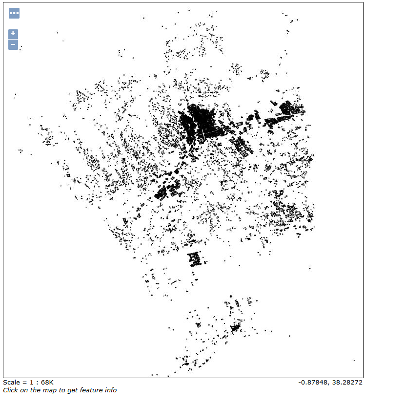

# Geoserver

## Connection with the PostGIS database

Once Geoserver is installed, log in and go to **Data → Data Stores → Add new store**.

In the next step, select the **PostGIS** option.

A form will appear where you need to enter the data source name and specify the connection parameters for the database. Once everything is set, click the **Save** button.

When the store is created, you will automatically be taken to the section where you can create/publish a new layer from this database. Click on the layer you want to publish, and it will be published automatically.

Once you select the layer, you will be taken to a form where you only need to change the Coordinate Reference System. The declared SRS should be changed to `EPSG:4326`, then click **Compute from data** in the "Native Bounding Box" section, followed by clicking **Compute from native bounding box** in the "Lat/Lon Bounding Box" section.

Finally, go to **Layer Preview** in the application, search for the published layer, and select the **OpenLayers** option to see how the layer is displayed.

If everything was done correctly, the layer should display without any issues.

## Create a raster layer

To create a raster layer, you first need a file with a `.tif` extension.

> [!NOTE]
> The raster layer file is [available in MODERATE's Google Cloud Storage service for authenticated users](https://storage.cloud.google.com/moderate-common-assets/solar-cadaster-pv-generation-cells.tif).

Once you have that file, upload it to the server, specifically in the Geoserver directory; otherwise, the program will not be able to make it available.

Inside Geoserver, go to the **Stores** section and select **Add new Store**.

Next, name the data store, select the workspace, and select the TIF file.

You will automatically be prompted to publish the layer. Do this by clicking on the **Publish** option.

After that, simply click the **Save** button. If everything is correct, you will see the layer in the **Layer Preview** section.

This is the result you should see:

